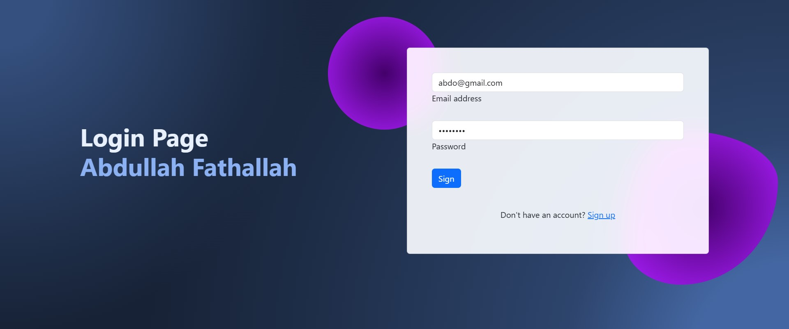

# Login and Registration System

This project is a simple login and registration system built using PHP and MySQL. It features a beautiful user interface powered by Bootstrap, with the ability to switch between the login and registration forms.

## Features

- User registration.
- User login.
- Success and error messages for registration and login.
- Interactive user interface using Bootstrap.
- Session management to store user data after login.
- A homepage that displays the user's name after login.
- Logout functionality.

## Requirements

- A web server with PHP support (e.g., XAMPP, WAMP, or MAMP).
- MySQL database.
- A modern web browser.

## Installation

1. Download or clone the project into a folder inside your local web server (e.g., `htdocs` if using XAMPP).
2. Import the database:
   - Open the `login.sql` file and execute it in phpMyAdmin or any database management tool to create the required table.
3. Modify the `connect.php` file to add your database connection details:
   ```php
   $host = 'localhost'; // Server name
   $user = 'username'; // Database username
   $password = 'password'; // Database password
   $db = 'login'; // Database name


# Login and Registration System

## Screenshots

### Login Page


### Signup Page


### Home Page After Login

